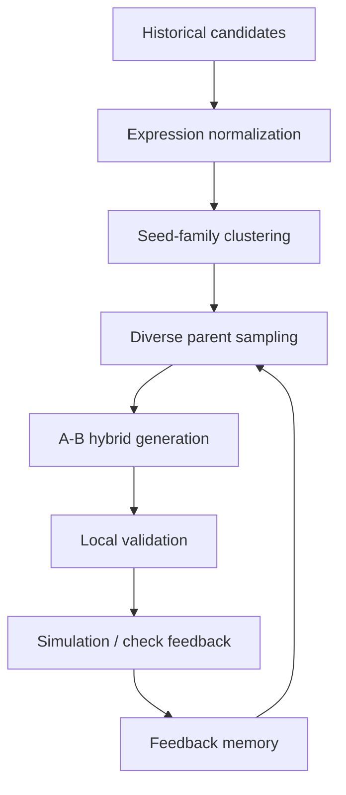

# Evolutionary Alpha Miner


**A research prototype for family-aware symbolic alpha discovery with evolutionary search and LLM-guided hybridization.**

Evolutionary Alpha Miner explores a structured way to generate formulaic alpha candidates without collapsing into duplicated expressions, repeated parents, or fragile backtest artifacts.

Instead of treating LLMs as unrestricted formula generators, this project uses them as constrained symbolic search assistants inside an evolutionary loop:

- normalize and cluster seed expressions into signal families
- sample diverse parent pairs across data domains
- preserve the primary signal while using a secondary signal as a weak modifier
- validate candidates before evaluation
- feed pass/fail results back into the next generation

> This public repository is a sanitized research framework. It does not contain private alpha expressions, API keys, credentials, proprietary datasets, real alpha IDs, or real simulation results.

---

## Why It Matters

Naive alpha generation tends to look productive at first, then quickly runs into familiar problems:

| Problem | Why it hurts |
| --- | --- |
| Near-duplicate formulas | Search appears active but explores the same signal family repeatedly. |
| Self-correlation traps | New candidates inherit too much of an existing parent signal. |
| Weak out-of-sample behavior | Backtests pass locally but fail under broader checks. |
| Template repetition | The generator reuses the same structures with different variable names. |
| No memory | Failed ideas keep reappearing because the search loop forgets them. |

This project frames alpha mining as **correlation-aware symbolic program evolution** rather than open-ended formula enumeration.

---

## Core Idea

The central mechanism is **A-B hybridization**:

- **A** is the main signal carrier.
- **B** is a weak gate, regime condition, dataset inspiration, or correlation breaker.

The goal is not to blend two formulas aggressively. The goal is to preserve useful signal structure from A while letting B introduce controlled diversity.



---

## What Makes This Different

### Family-aware search

Expressions are normalized and assigned family hashes so the search loop can avoid breeding superficial duplicates.

### Constrained LLM generation

The LLM is not asked to invent arbitrary trading formulas. It operates under mutation rules such as:

- preserve A's core signal
- use B only as a weak modifier
- avoid destructive A-B spreads
- avoid repeated templates
- prefer interpretable structures

### Diversity-aware parent sampling

Candidate parents are selected with constraints on seed families, parent reuse, tag pairs, and prior scores.

Example tag pairs:

```text
price + volume
price + option
volume + fundamental
news + price
analyst + price
unknown + price
```

### Feedback-guided evolution

Evaluation results are categorized into feedback buckets such as:

- landed candidates
- strong but not landed candidates
- low Sharpe / low fitness failures
- suspected self-correlation traps
- turnover failures
- concentrated-weight failures

The next generation can use this memory to avoid repeating weak search paths.

---

## Quickstart

Clone the repository:

```bash
git clone https://github.com/gaosu0715-lgtm/Evolutionary-Alpha-Miner.git
cd Evolutionary-Alpha-Miner
```

Install dependencies:

```bash
python -m venv .venv
source .venv/bin/activate
pip install -r requirements.txt
```

Run the synthetic demo:

```bash
python examples/toy_demo.py
```

The demo uses fake expressions and a fake evaluator. It is designed to show the research workflow, not to produce real trading signals.

Expected flow:

```text
synthetic seed pool
-> family hashing
-> diverse A-B parent pairing
-> constrained candidate hybridization
-> fake evaluation
-> feedback summary
```

---

## Repository Structure

```text
Evolutionary-Alpha-Miner/
├── README.md
├── ROADMAP.md
├── CONTRIBUTING.md
├── CITATION.cff
├── LICENSE
├── requirements.txt
├── .gitignore
└── examples/
    └── toy_demo.py
```

---

## Research Direction

This project sits at the intersection of:

- genetic programming
- symbolic regression
- program synthesis
- LLM agents
- active learning
- automated alpha discovery
- quantitative finance research

The main research question:

> Can LLMs improve symbolic alpha search when they are constrained by seed-family memory, parent diversity, and evaluation feedback?

Future work will focus on turning the toy workflow into a more modular research toolkit:

- expression parser and normalizer
- seed-family clustering module
- diversity-aware parent sampler
- mutation template library
- feedback memory
- search-loop visualization
- benchmark against random generation

See [ROADMAP.md](./ROADMAP.md) for the current plan.

---

## What This Repository Does Not Contain

For safety and privacy, this public repository excludes:

- private credentials
- API keys
- real alpha expressions
- real alpha IDs
- proprietary datasets
- real simulation outputs
- platform-specific private results
- production mining notebooks

All included examples are synthetic.

---

## Who This Is For

This repository may be useful if you are interested in:

- symbolic alpha research
- LLM-assisted program search
- evolutionary computation for formula discovery
- reducing duplicate candidates in automated search
- building feedback loops for research agents

It is intentionally small right now. The goal is to make the research idea easy to inspect, reproduce, and extend.

---

## Disclaimer

This project is for research and educational purposes only.

It does not provide financial advice, investment advice, trading signals, or proprietary alpha formulas. Any examples in this repository are synthetic and should not be interpreted as real trading strategies.

---

## Citation

If you find this project useful, you can cite or reference it as:

```text
Evolutionary Alpha Miner: Family-aware symbolic alpha discovery with evolutionary search and LLM-guided hybridization.
https://github.com/gaosu0715-lgtm/Evolutionary-Alpha-Miner
```
